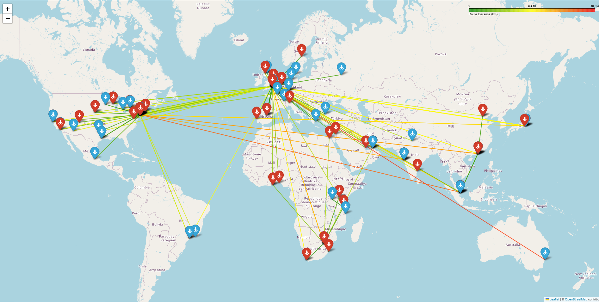

# Flight Distance Analysis Project

This project was developed as part of a recruitment process and focuses on analyzing and verifying point-to-point flight distances provided by airlines. The goal is to identify discrepancies in the mileage data, ensure data consistency, and provide accurate distance calculations for business analytics.

---

## Project Overview

### **Problem Statement**
A global financial client spends over $370M annually on air travel and suspects that some contracted airlines intentionally overstate their mileage to manipulate cost-per-mile KPIs. The task is to calculate the true point-to-point distance between airport pairs based on latitude and longitude data and compare it to the provided distances.

### **Objectives**
1. Identify inconsistencies in the provided dataset (e.g., duplicate or incorrect coordinates).
2. Clean and preprocess the data for accurate analysis.
3. Calculate precise point-to-point distances using the Haversine formula.
4. Export a reliable dataset with corrected distances for further comparison.

---

## Dataset Description

### **Input File**
`FlightDistanceTest.csv` contains the following key columns:
- `Departure Code`, `Arrival Code`: Airport codes.
- `Departure_lat`, `Departure_lon`: Latitude and longitude of departure airports.
- `Arrival_lat`, `Arrival_lon`: Latitude and longitude of arrival airports.
- `Normalised City Pair`: Combined departure and arrival city names.

### **Output File**
`FlightDistanceResults.csv` includes the following key columns:
- Corrected departure coordinates.
- Arrival coordinates.
- Calculated reference distances (in kilometers).

### **Disclaimer**
Due to the sensitive nature of the data, the original CSV files (`FlightDistanceTest.csv`) cannot be included in this repository to respect the confidentiality of the company's information. The project was conducted using real-world data provided during the recruitment process.

---

## Key Features

1. **Data Exploration**: Initial analysis of the dataset to identify inconsistencies, missing values, and anomalies.
2. **Data Cleaning**: Correcting errors in airport coordinates by selecting the most frequent values.
3. **Distance Calculation**: Implementation of the Haversine formula to calculate geodesic distances between airport pairs.
4. **Export**: Cleaned and enriched dataset ready for comparison with airline-provided mileage data.

---

## 🗺️ Interactive Map

